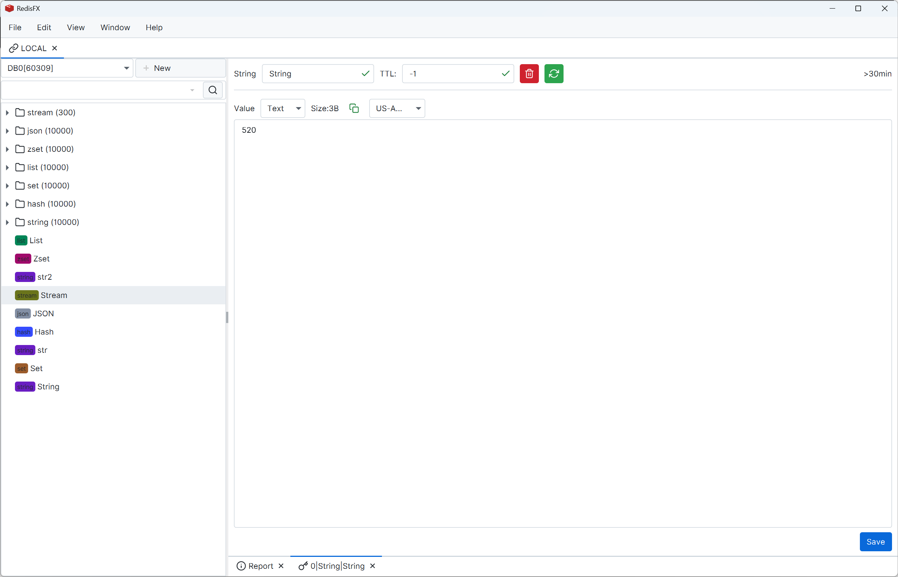
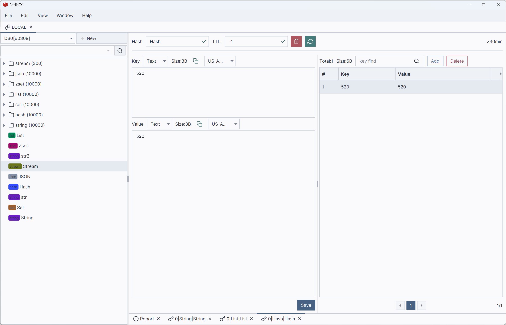
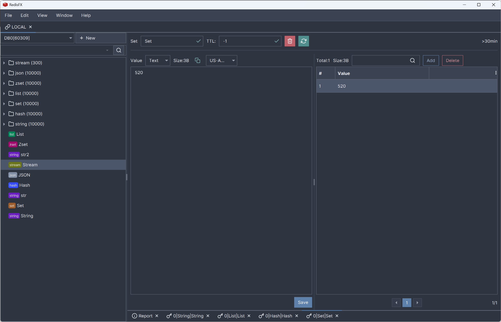
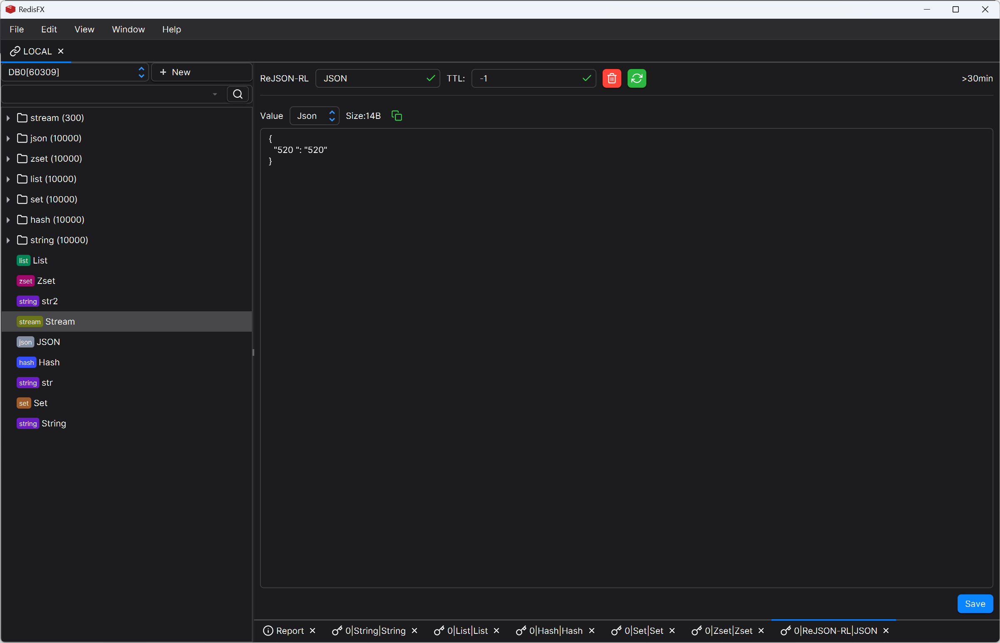
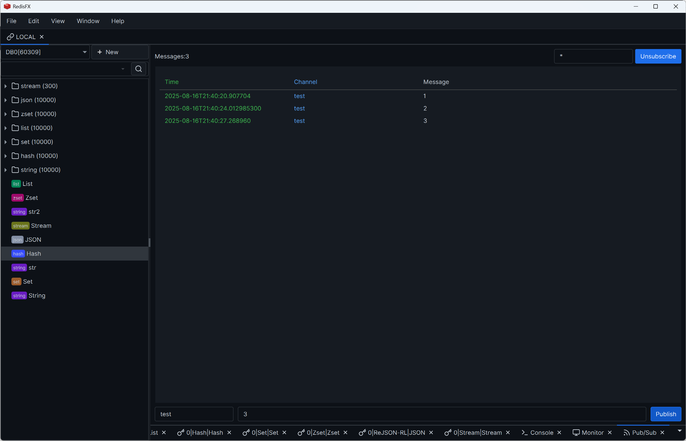

# RedisFX
> Redis GUI tool developed with JavaFX
[Download](https://github.com/tanhuang2016/RedisFX/releases)
 

## Language
English |  [中文](README.zh-CN.md)

## Features
- ✅ SSH and SSL protocol support
- ✅ Cluster and Sentinel mode support
- ✅ String, List, Hash, Set, Zset, JSON, Stream type support
- ✅ Console, command monitoring, publish/subscribe, information reports
- ✅ Multiple themes, multi-language, and other personalized configurations
- ✅ Support for Windows (x86), Linux (x86 and arm), MacOS (x86 and arm)

## Existing Issues
- ⚠️ High memory usage and code not standardized
- ⚠️ Some interactive functions use UI thread causing slow response
- ⚠️ Other issues to be optimized...

## Roadmap
- ⬜ ⭐⭐⭐ Code refactoring, memory optimization, performance improvement
- ⬜ ⭐⭐⭐ Interaction optimization, lazy loading design
- ⬜ ⭐⭐ Cross-platform execution package improvement
- ⬜ ⭐⭐ Optimize the operational details and improve the existing functional design
- ⬜ ⭐ More personalized configuration support
- ⬜ ⭐ Custom plugin extension capability for key-value parsing

## Development Environment
- [v1.x](https://github.com/tanhuang2016/RedisFX/tree/freeze/v1.0.4) developed with JDK1.8 native JavaFX (frozen version)
- [v2.x](https://github.com/tanhuang2016/RedisFX/tree/release-2.x) developed with JDK21 based on [v1.x](https://github.com/tanhuang2016/RedisFX/tree/freeze/v1.0.4), providing a beautiful UI library with more complete features (under continuous update)

## Feature Demo

## Acknowledgements
You've scrolled to the end, thank you for giving us a Star! 🙏🙏🙏
