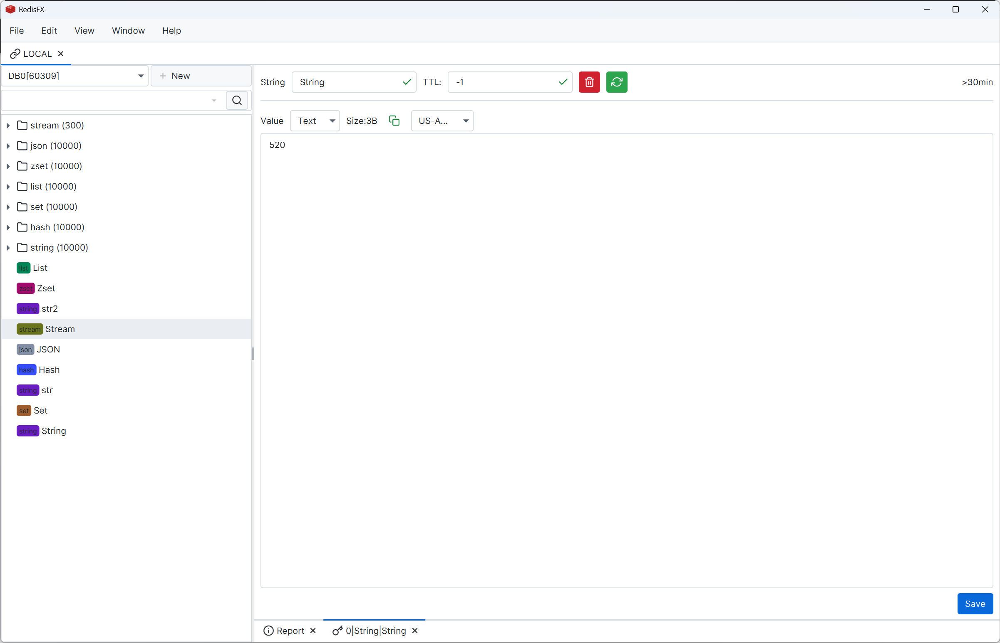
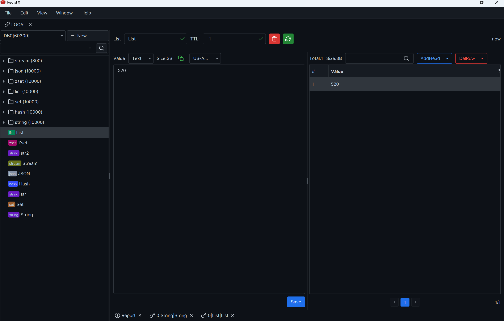
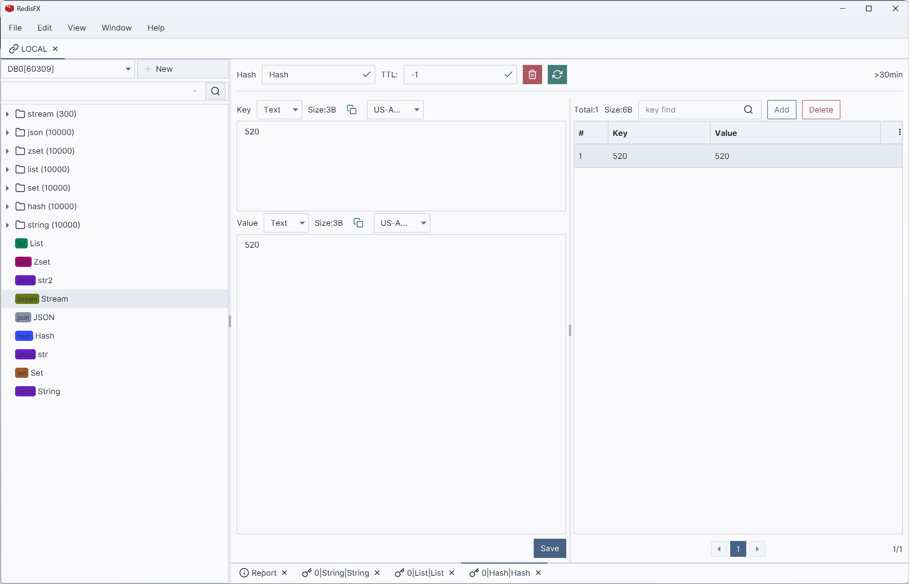
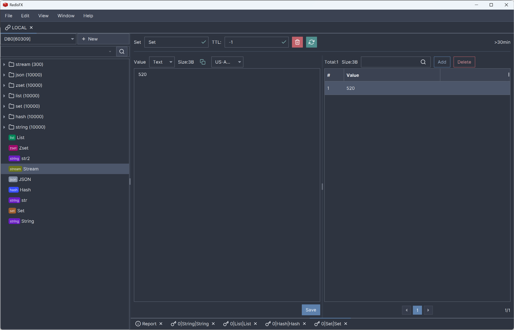
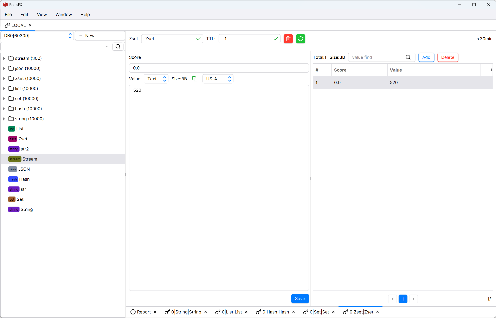
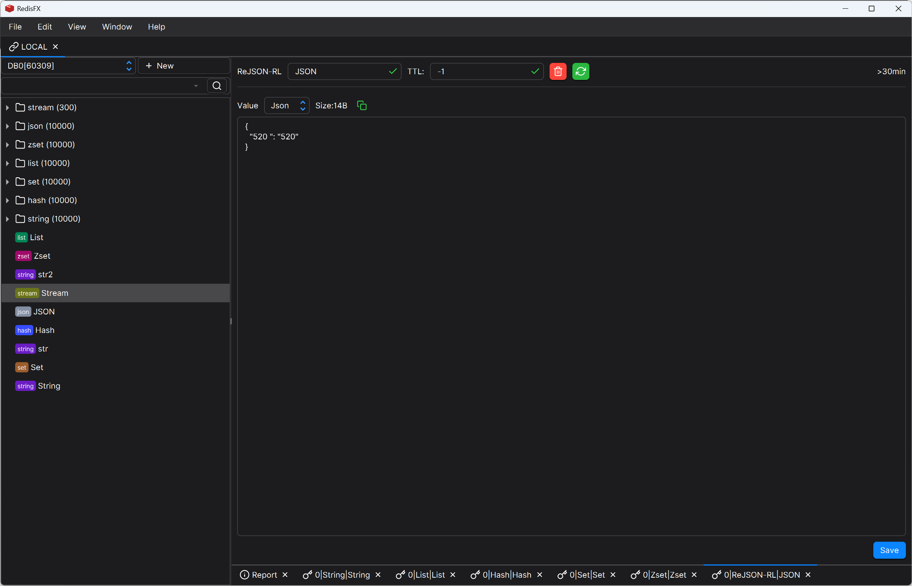
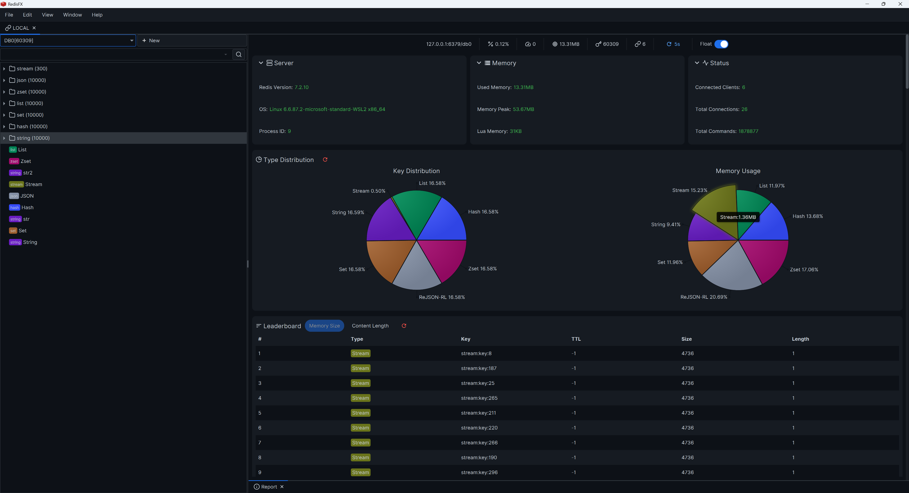
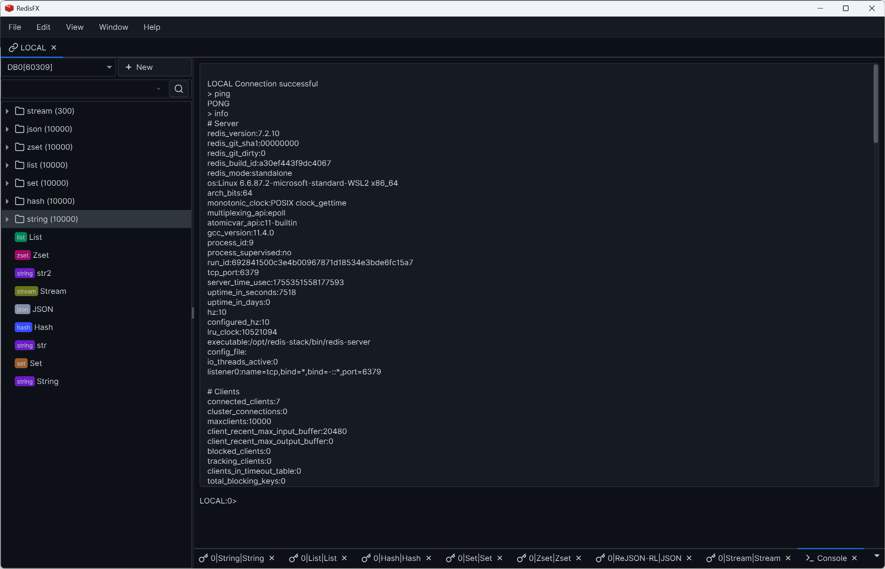
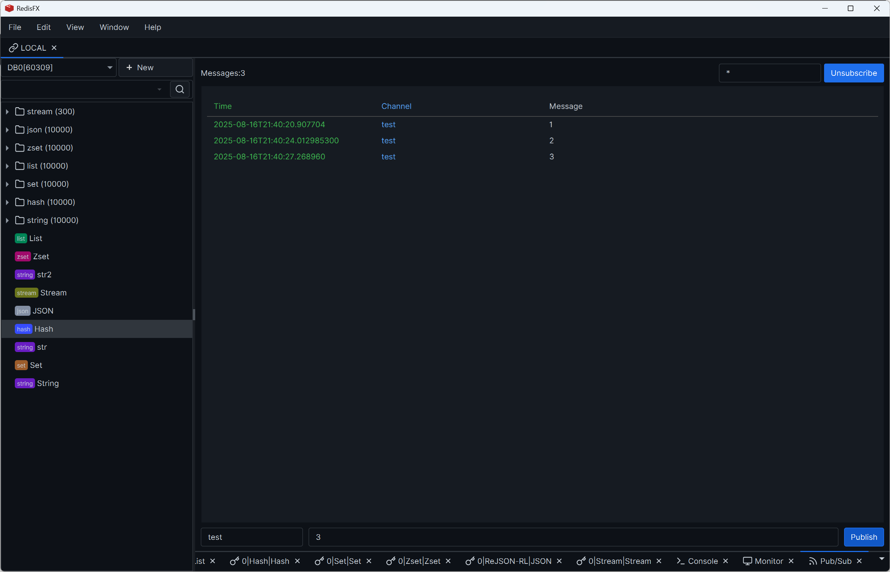
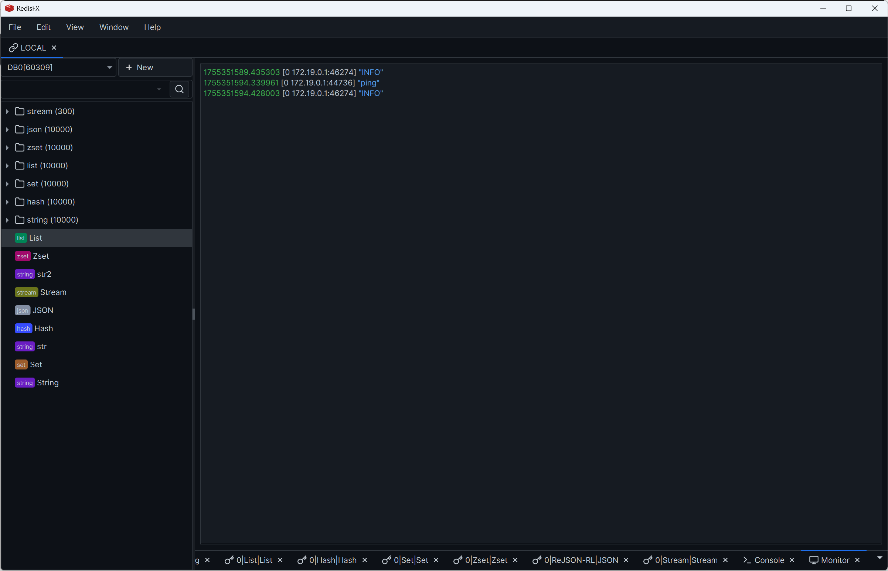

# RedisFX
> Redis GUI tool developed with JavaFX
[Download](https://github.com/tanhuang2016/RedisFX/releases)
 

## Language
English |  [中文](README.zh-CN.md)

## Features
- ✅ SSH and SSL protocol support
- ✅ Cluster and Sentinel mode support
- ✅ String, List, Hash, Set, Zset, JSON, Stream type support
- ✅ Console, command monitoring, publish/subscribe, information reports
- ✅ Multiple themes, multi-language, and other personalized configurations
- ✅ Support for Windows (x86), Linux (x86 and arm), MacOS (x86 and arm)

## Existing Issues
- ⚠️ High memory usage and code not standardized
- ⚠️ Some interactive functions use UI thread causing slow response
- ⚠️ Other issues to be optimized...

## Roadmap
- ⬜ ⭐⭐⭐ Code refactoring, memory optimization, performance improvement
- ⬜ ⭐⭐⭐ Interaction optimization, lazy loading design
- ⬜ ⭐⭐ Cross-platform execution package improvement
- ⬜ ⭐⭐ Optimize the operational details and improve the existing functional design
- ⬜ ⭐ More personalized configuration support
- ⬜ ⭐ Custom plugin extension capability for key-value parsing

## Development Environment
- [v1.x](https://github.com/tanhuang2016/RedisFX/tree/freeze/v1.0.4) developed with JDK1.8 native JavaFX (frozen version)
- [v2.x](https://github.com/tanhuang2016/RedisFX/tree/release-2.x) developed with JDK21 based on [v1.x](https://github.com/tanhuang2016/RedisFX/tree/freeze/v1.0.4), providing a beautiful UI library with more complete features (under continuous update)

## Feature Demo

## Acknowledgements
You've scrolled to the end, thank you for giving us a Star! 🙏🙏🙏

## Contributors  ✨

<!-- ALL-CONTRIBUTORS-LIST:START - Do not remove or modify this section -->
<!-- prettier-ignore-start -->
<!-- markdownlint-disable -->
<table>
  <tbody>
    <tr>
      <td align="center" valign="top" width="14.28%"><a href="https://github.com/Tan000321"> <b>Tan000321</b></a> <a href=" https://github.com/tanhuang2016/RedisFX/tanhuang2016/RedisFX/issues?q=author%3ATan000321" title="Bug reports">🐛</a></td>
      <td align="center" valign="top" width="14.28%"><a href="https://github.com/crazyweeds"> <b>crazyweeds</b></a> <a href=" https://github.com/tanhuang2016/RedisFX/tanhuang2016/RedisFX/issues?q=author%3Acrazyweeds" title="Bug reports">🐛</a></td>
    </tr>
  </tbody>
  <tfoot>
    <tr>
      <td align="center" size="13px" colspan="7">
        
          <a href="https://all-contributors.js.org/docs/en/bot/usage">Add your contributions</a>
        </img>
      </td>
    </tr>
  </tfoot>
</table>

<!-- markdownlint-restore -->
<!-- prettier-ignore-end -->

<!-- ALL-CONTRIBUTORS-LIST:END -->
<!-- prettier-ignore-start -->
<!-- markdownlint-disable -->

<!-- markdownlint-restore -->
<!-- prettier-ignore-end -->

<!-- ALL-CONTRIBUTORS-LIST:END -->