

# RedisFX
> 使用JavaFX开发的Redis GUI工具
[📥 下载地址](https://github.com/tanhuang2016/RedisFX/releases)
[📖 使用指南](https://redisfx.tanh.site/zh)
 

## 语言
[English](README.en-US.md)  | 中文

## 特性
- ✅ SSH、SSL/TLS 协议支持
- ✅ Cluster、Sentinel 模式支持
- ✅ String、List、Hash、Set、Zset、JSON、Stream 类型支持
- ✅ 控制台、命令监控、发布订阅、信息报表
- ✅ 多主题、多语言、其他个性化配置
- ✅ 支持Windows(x86)、Linux(x86和arm)、MacOS(x86和arm)

## 还存在的问题
- ⚠️ 内存占用偏大(Windows和Linux已采用ZGC使内存降低三分之一)
- ⚠️ 部分交互功能使用UI线程导致响应缓慢
- ⚠️ 其他用户体验优化...

## 规划
- ⬜ ⭐⭐⭐ 代码重构、体验优化、提升性能
- ⬜ ⭐⭐⭐ 交互优化、惰性加载设计
- ⬜ ⭐⭐ 构建跨平台执行包完善、支持GraalVM原生镜像打包
- ⬜ ⭐⭐ 操作细节优化、完善现有功能设计
- ⬜ ⭐ 更多的个性化配置支持
- ⬜ ⭐ 为键值解析提供自定义插件扩展能力

## 开发环境
- [v1.x](https://github.com/tanhuang2016/RedisFX/tree/freeze/v1.0.4)使用JDK1.8原生JavaFX开发(已封版)
- [v2.x](https://github.com/tanhuang2016/RedisFX/tree/release-2.x)使用JDK21基于[v1.x](https://github.com/tanhuang2016/RedisFX/tree/freeze/v1.0.4)开发，提供了漂亮的UI库且功能更完善(持续更新中)

## 功能效果图展示
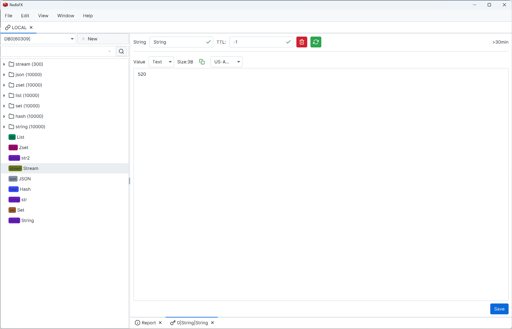
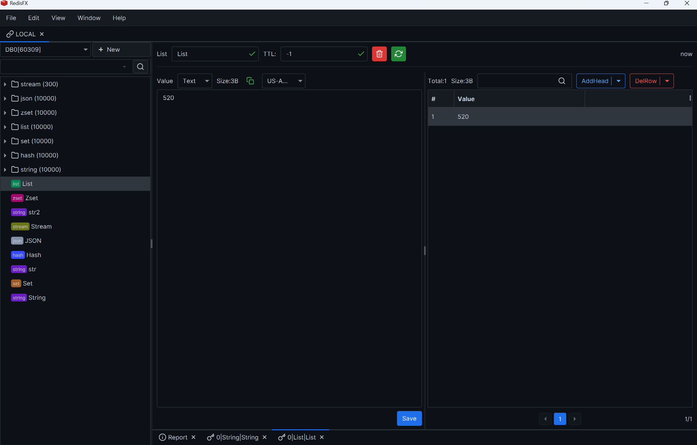
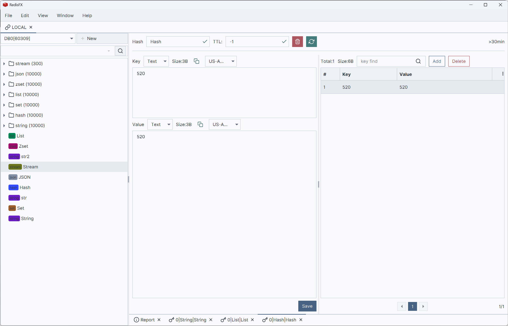
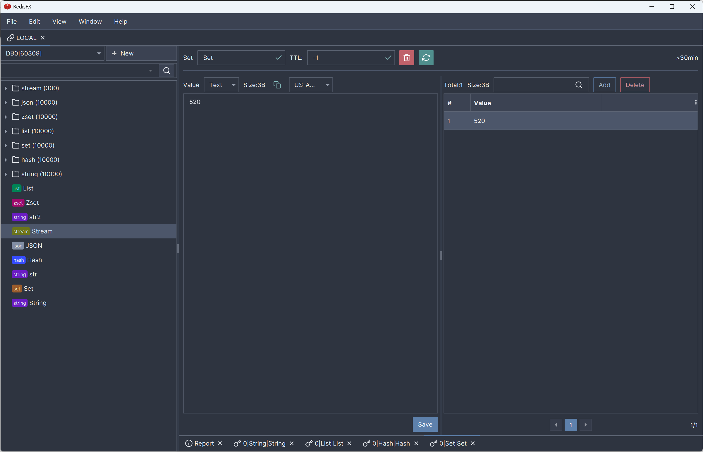
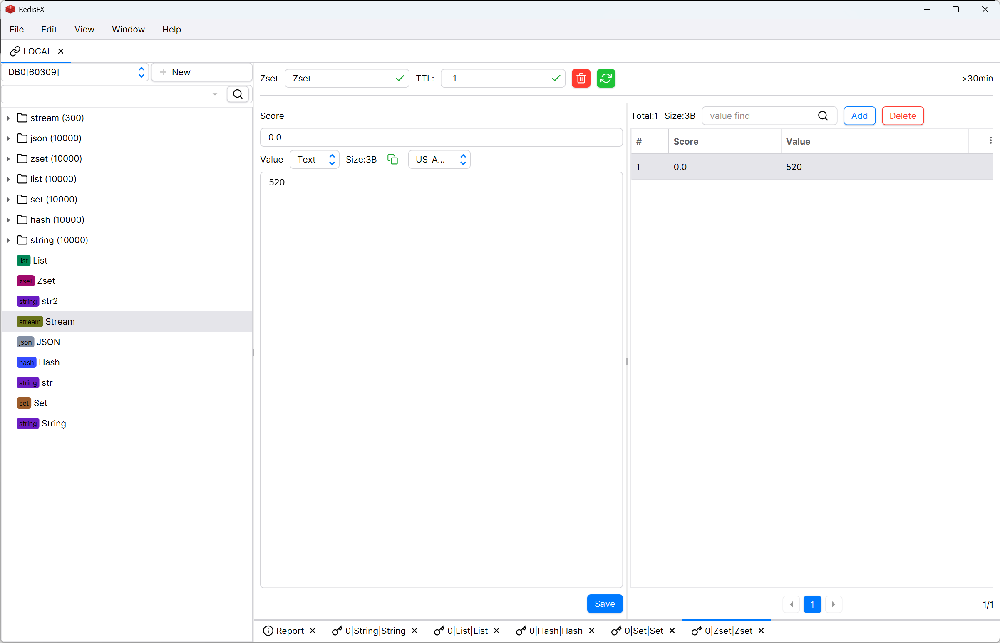
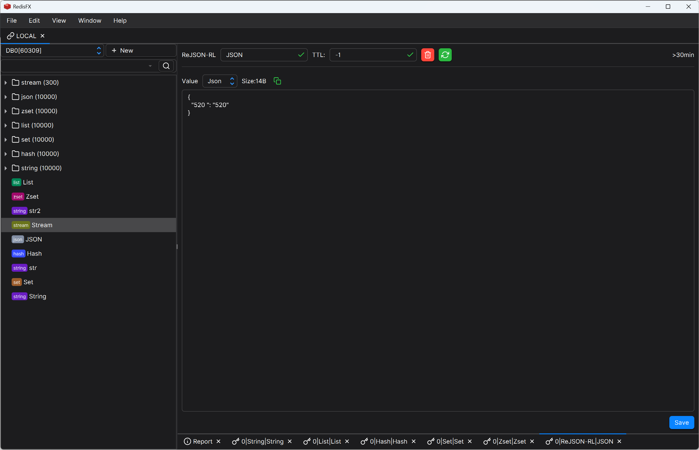
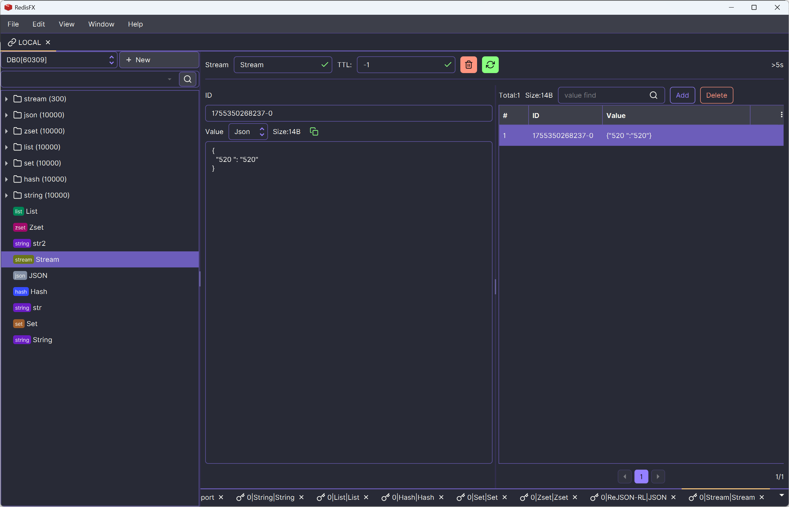
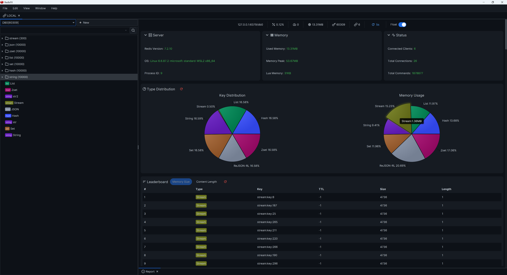
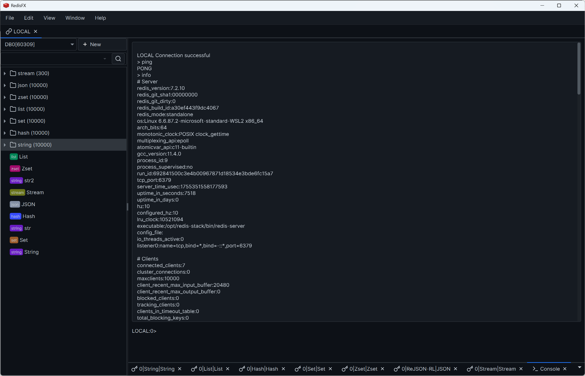
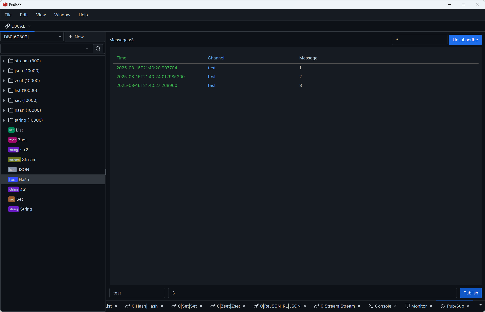
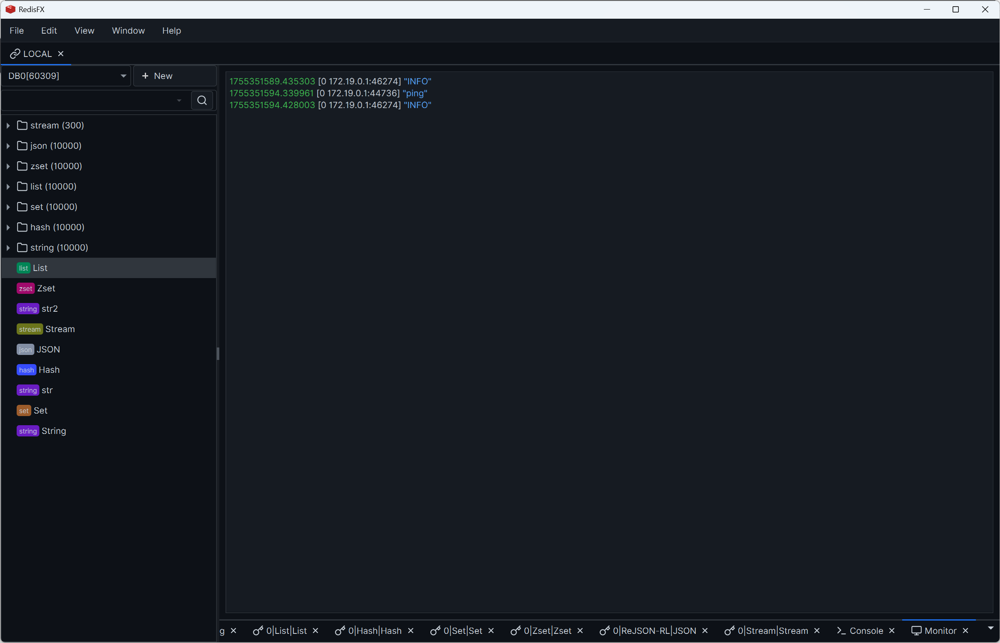
## RedisFX IDEA插件截图
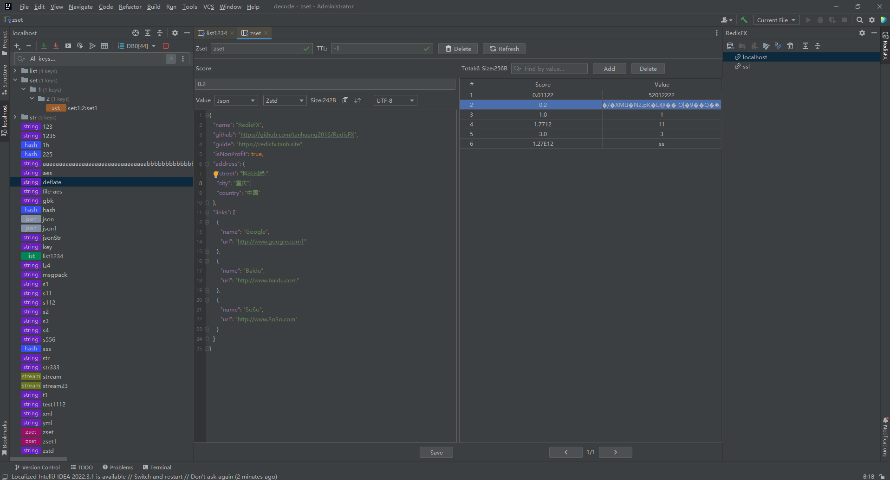
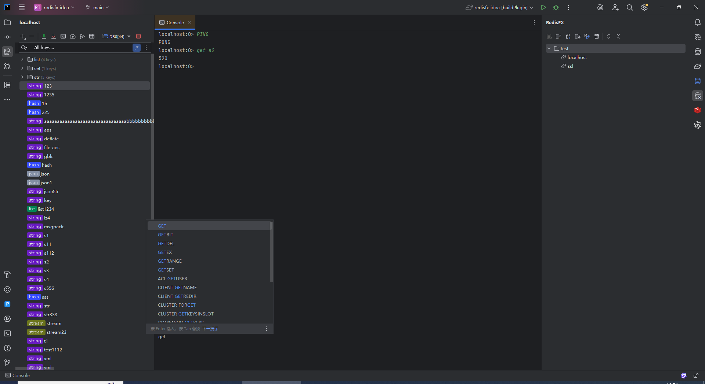
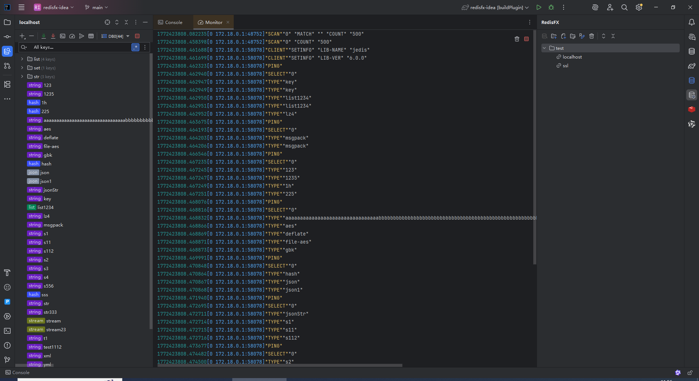
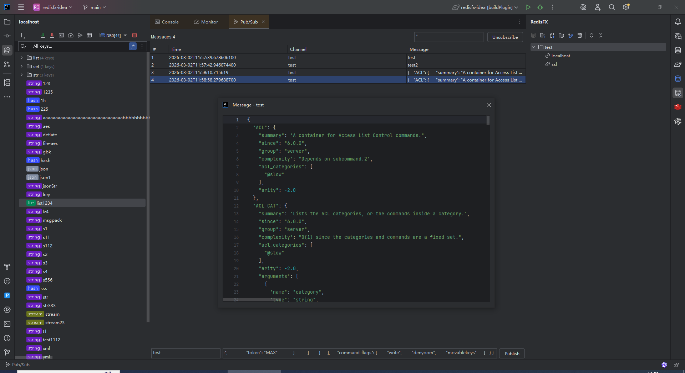
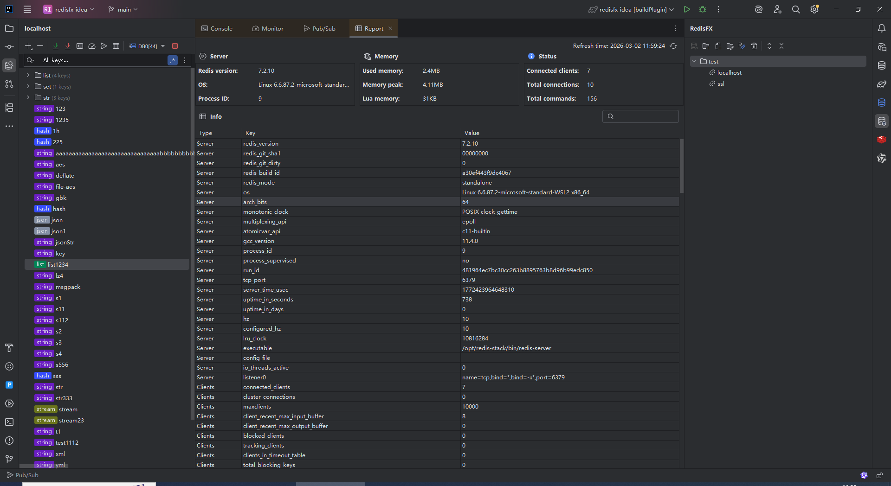

## 感谢支持
都滑到最后了、谢谢大佬给个Star吧 🙏🙏🙏

## 贡献者  ✨

<!-- ALL-CONTRIBUTORS-LIST:START - Do not remove or modify this section -->
<!-- prettier-ignore-start -->
<!-- markdownlint-disable -->
<table>
  <tbody>
    <tr>
      <td align="center" valign="top" width="14.28%"><a href="https://github.com/Tan000321"> <b>Tan000321</b></a> <a href=" https://github.com/tanhuang2016/RedisFX/tanhuang2016/RedisFX/issues?q=author%3ATan000321" title="Bug reports">🐛</a></td>
      <td align="center" valign="top" width="14.28%"><a href="https://github.com/crazyweeds"> <b>crazyweeds</b></a> <a href=" https://github.com/tanhuang2016/RedisFX/tanhuang2016/RedisFX/issues?q=author%3Acrazyweeds" title="Bug reports">🐛</a></td>
      <td align="center" valign="top" width="14.28%"><a href="http://xuzhen1994.github.io"> <b>xuzhen</b></a> <a href="#ideas-xuzhen1994" title="Ideas, Planning, & Feedback">🤔</a></td>
    </tr>
  </tbody>
</table>

<!-- markdownlint-restore -->
<!-- prettier-ignore-end -->

<!-- ALL-CONTRIBUTORS-LIST:END -->
<!-- prettier-ignore-start -->
<!-- markdownlint-disable -->

<!-- markdownlint-restore -->
<!-- prettier-ignore-end -->

<!-- ALL-CONTRIBUTORS-LIST:END -->